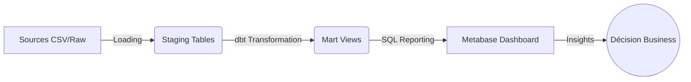
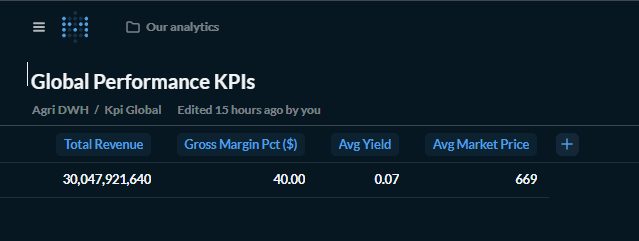
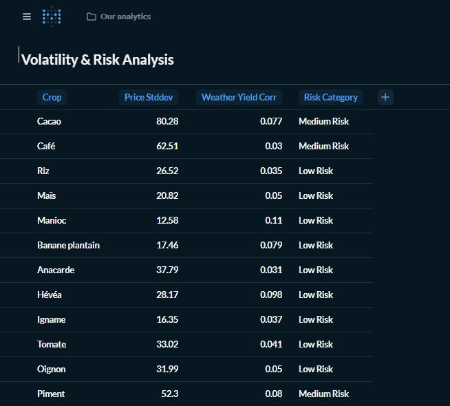
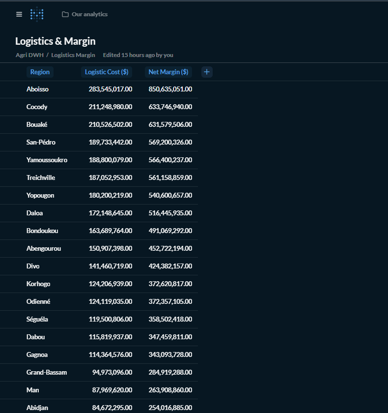
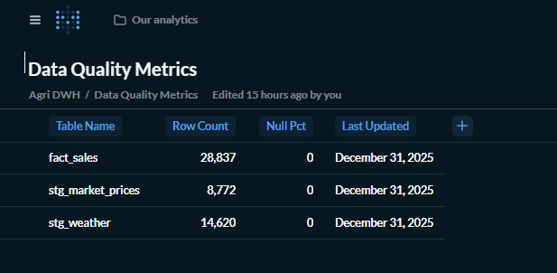

# Project 2: Agri Dashboard (Metabase)

## 📌 Business Case

**Contexte :**
Une coopérative agricole ivoirienne gère plusieurs cultures (Cacao, Hévéa, Vivrier) sur différentes régions.

**Problème :**
Les managers manquent de visibilité sur la rentabilité réelle. Ils subissent la volatilité des prix et des coûts logistiques mal maîtrisés.

**Solution Data :**
Mise en place d'un **Data Warehouse (DWH)** robuste et d'un **Dashboard Décisionnel** pour piloter l'activité en temps réel.

**3 Décisions Clés rendues possibles :**
1.  🎯 **Prioriser Cocody** : La région affiche la marge la plus élevée → y concentrer les investissements.
2.  ⚠️ **Surveiller le Piment** : Volatilité identifiée comme moyenne → sécuriser les contrats de vente.
3.  🚚 **Optimiser la Logistique** : Identifier les régions où les coûts de transport plombent la marge nette (ex: Nord).

---

## 🛠️ Technical Stack

*   **Database**: PostgreSQL (Container `agri_dwh_pg`) - Stockage centralisé.
*   **Transformation**: dbt (Data Build Tool) - Nettoyage, tests et création de vues métiers (`marts`).
*   **Analysis**: SQL Avancé - Utilisation de fonctions statistiques (`STDDEV`, `CORR`) et logique métier (`CASE`).
*   **Visualization**: Metabase (Container `metabase`) - Dashboard interactif.
*   **Infrastructure**: Docker & Docker Compose - Déploiement portable et reproductible.

---

## 🔄 Data Flow



*(Sources → Staging → Mart Views → Metabase → Décision)*

---

## 📊 Dashboard Structure (V1.1)

Le dashboard **Agri Intelligence V1** est structuré en 4 axes d'analyse :

### 1. Global Performance
Vue d'ensemble de la santé financière et opérationnelle.
*   **KPIs** : Revenue Total, Marge Brute %, Rendement (T/Ha), Prix Moyen.
*   **Analyse** : Tendances mensuelles.

### 2. Volatility & Risk
Analyse des risques de marché pour chaque culture.
*   **Viz** : Bar Chart "Price Standard Deviation".
*   **Insight** : Identification des cultures "High Risk" vs "Stable".

### 3. Logistics & Margin
Impact des coûts logistiques sur la rentabilité finale.
*   **Viz** : Marge Nette par Région (triée).
*   **Insight** : Arbitrage géographique (ex: Ouest vs Nord).

### 4. Data Quality
Monitoring de la fiabilité des données.
*   **Tableau** : % de valeurs nulles, volumétrie, fraîcheur des données.

---

## ⚠️ Limitations (V1.1)

Ce projet est une démonstration technique ("Vertical Slice") et présente certaines limites connues :

1.  **Données Simulées** : Les données de vente et météo sont générées pour l'exercice et ne reflètent pas la réalité du terrain.
2.  **Pas de Temps Réel** : L'ETL est conçu pour un chargement par batch (quotidien/mensuel), pas pour du streaming.
3.  **Coûts Estimés** : Les coûts logistiques (10-20%) sont des approximations basées sur la région, sans intégrer les coûts réels de carburant/flotte.

---

## 📸 Screenshots

*(Ajoutez vos captures d'écran ici)*

> **Note** : Le dashboard est accessible localement sur [http://localhost:3000/dashboard/2-agri-intelligence-v1](http://localhost:3000/dashboard/2-agri-intelligence-v1)

### Page Performance


### Page Volatility


### Page Logistics


### Data Quality


---

## 🚀 Quick Start

1.  **Démarrer l'infrastructure** :
    ```bash
    docker-compose up -d
    ```

2.  **Accéder à Metabase** :
    *   URL : `http://localhost:3000`
    *   User : `admin@agri.com`
    *   Pass : `Password123!`

3.  **Lancer le Dashboard** :
    *   Allez dans "Our analytics" > "Agri Intelligence V1".

---

## 🔮 What I would do next

Si le projet devait passer en production réelle :
1.  **Orchestrator** : Remplacer le script PowerShell par **Airflow** ou **Dagster** pour gérer les dépendances et les retries.
2.  **Incremental Models** : Passer les grosses tables (`fact_sales`) en **modèle incrémental** dbt pour réduire les temps de calcul et les coûts cloud.
